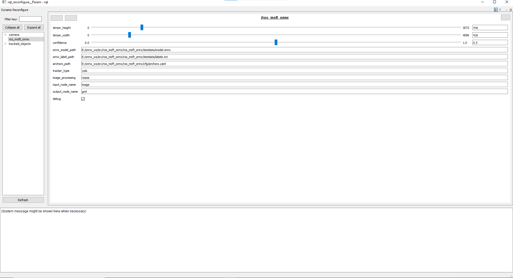

# ONNX (Open Neural Network Exchange) ROS 1 Node

[ONNX Runtime](https://github.com/microsoft/onnxruntime) is an open source inference engine for ONNX Models.
ONNX Runtime Execution Providers (EPs) enables the execution of any ONNX model using a single set of inference APIs that provide access to the best hardware acceleration available.

In simple terms, developers no longer need to worry about the nuances of hardware specific custom libraries to accelerate their machine learning models.
This repository demonstrates that by enabling the same code with ROS 2 to run on different hardware platforms using their respective AI acceleration libraries for optimized execution of the ONNX model.

## System Requirement

  * Microsoft Windows 10 64-bit or Ubuntu 20.04 LTS x86_64
  * ROS Noetic
  * To make use of the hardware acceleration, the system is required to be compatible with [**CUDA 10.1**](https://developer.nvidia.com/cuda-toolkit) and [**cuDNN 7.6.5**](https://developer.nvidia.com/cudnn).

> For GPU support, please follow the installation steps on NVIDIA portal before proceeding.

## How to Build
The Onnx ROS Node is distrubted as source. To consume it in your robot, clone the ros_msft_onnx sources into your workspace.

* Windows
```Batchfile
mkdir c:\workspace\onnx_demo\src
cd c:\workspace\onnx_demo\src
git clone https://github.com/ms-iot/ros_msft_onnx -b noetic-devel

::For running the samples, clone `ros_msft_camera` as well
git clone https://github.com/ms-iot/ros_msft_camera --recursive
```

* Ubuntu
```sh
mkdir -p onnx_demo/src
cd onnx_demo/src
git clone https://github.com/ms-iot/ros_msft_onnx -b noetic-devel

# For running the samples, clone `cv_camera` as well
git clone https://github.com/OTL/cv_camera --recursive
```

## Building
ONNX Runtime team is releasing different binaries for CPU and GPU (CUDA) support. To switch between the two, a workspace rebuild is required.


Make sure to source your ROS version before building.

* CPU Processing

```Batchfile
cd onnx_demo

catkin_make -DCUDA_SUPPORT=OFF
```

* GPU Processing (CUDA)

```Batchfile
cd onnx_demo

catkin_make -DCUDA_SUPPORT=ON
```

## Running the samples
There are two launch files included as samples in the launch folder.
An object tracking demo and a deep pose detection demo. 

### Object Tracker Demo
 `tracker.launch` demonstrates tracking of up to 20 classes icluding people in images/video.

To run the person tracking detection demo, source the workspace and then roslaunch the launch file.

```Batchfile
c:\workspace\devel\setup.bat
roslaunch ros_msft_onnx tracker.launch
```

In another command prompt or terminal, run rviz and add the `/tracked_objects/image` topic to see the highlighted people when they have been detected.
```Batchfile
rosrun rviz rviz
```

For a project trained using customvision.ai at runtime you can change the parameters using rqt_reconfigure.

```Batchfile
rosrun rqt_reconfigure rqt_reconfigure
```
Please follow this order, start by placing the files of interest i.e. the onnx model(.onnx) file and labels.txt obtained from the relevant onnx zip file downloaded from customvision.ai to `ros_msft_onnx/testdata/` or a known location. Change the anchor values in the cfg/anchors.yaml file by commenting the first line and uncommenting the second line, finally update `input_node_name` to "data", `output_node_name` to "model_outputs0" and update any other relevant parameters shown below:



### Deep Pose Detection Demo
`pose.launch` demonstrates estimating the position and rotation of an engine block from images\video.In preperation for running the engine pose demo:
* Copy [Engine pose ONNX model](https://github.com/ms-iot/ros_msft_onnx_demo/releases/download/0.0/engine.onnx) to `ros_msft_onnx/testdata/`.
* Download the `Engine_Block_-_Scaled.stl` mesh from [Thingiverse](https://www.thingiverse.com/thing:1911808) designed by Eric Harrell, and used with permission. Move or copy it into `ros_msft_onnx/testdata/`.

To run the engine pose detection demo, source the workspace and then roslaunch the launch file.
```Batchfile
roslaunch ros_msft_onnx pose.launch
```


> While 'Pose' processing is enabled, the service required to generate the model has not been published as of April 2021

## Property Descriptions

| Property         | Description                                                                 |
| ---------------- | --------------------------------------------------------------------------- |
| onnx_model_path  | Path to the model.onnx file                                                 |
| confidence       | Minimum confidence before publishing an event. 0 to 1                       |
| tensor_width     | The Width of the input to the model.                                        |
| tensor_height    | The Height of the input to the model.                                       |
| tracker_type     | Currently enabled - `yolo` or `pose`.                                       |
| image_processing | `resize`, `scale` or `crop`                                                 |
| debug            | `true` or `false` determines if a debug image is published                  |
| image_topic      | The image topic to subscribe to                                             |
| label            | used to filter the found object to a specific label                         |
| mesh_rotation    | The orientation of the mesh when debug rendering pose                       |
| mesh_scale       | The scale of the mesh when debug rendering pose                             |
| mesh_resource    | The mesh used for debug rendering pose                                      |
| model_bounds     | 9 coordinates used to perform the point in perspective caluclation for pose |
| calibration      | Path to the OpenCV calibration file for point in persective                 |

## Subscriptions
Onnx subscribes to the topic listed in the `image_topic` property, or `/camera/image_raw`

## Publishing
Onnx Publishes the following topics:

### /tracked_objects/image
Outputs an image with highlighing if the debug property is set

### /tracked_objects/
An array of `visualization_msgs::Marker` for found objects

### /detected_object
A single instance of the DetectedObjectPose message, which is output when tracker_type is set to pose.

# Contributing

This project welcomes contributions and suggestions.  Most contributions require you to agree to a
Contributor License Agreement (CLA) declaring that you have the right to, and actually do, grant us
the rights to use your contribution. For details, visit https://cla.microsoft.com.

When you submit a pull request, a CLA-bot will automatically determine whether you need to provide
a CLA and decorate the PR appropriately (e.g., label, comment). Simply follow the instructions
provided by the bot. You will only need to do this once across all repos using our CLA.

This project has adopted the [Microsoft Open Source Code of Conduct](https://opensource.microsoft.com/codeofconduct/).
For more information see the [Code of Conduct FAQ](https://opensource.microsoft.com/codeofconduct/faq/) or
contact [opencode@microsoft.com](mailto:opencode@microsoft.com) with any additional questions or comments.